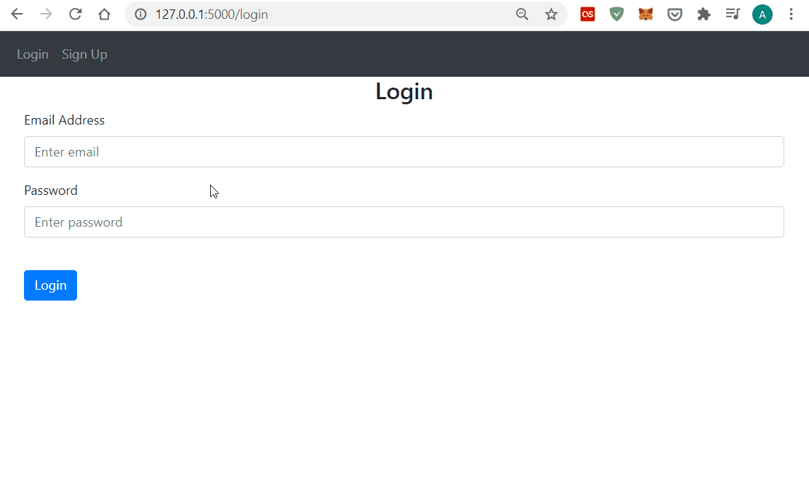

## Flaks Web App
Simple Flask application with SQL database. This app is created during learning how to build web applications using 
Flask. 

Allows to create a new User account and/or login to the site. While logged in, a User may add/delete personalised 
notes. Both User and Note objects refer to an SQL database. If not accessible, the app generates a new db file.

Based on [YouTube tutorial](https://www.youtube.com/watch?v=dam0GPOAvVI) by TechWithTim. Includes some minor adjustments 
and additional comments.


<kbd></kbd>

### How to use
Repository is available for download.
```
# Clone repository
$ git clone https://github.com/albertkuc/Flask-Web-App.git

# Install dependencies
$ pip install -r requirements.txt
```

### Credits
The content of this repository is originally provided by TechWithTim:
* website: [techwithtim.net](https://www.techwithtim.net/)
* YouTube channel: [youtube.com/c/TechWithTim](https://www.youtube.com/c/TechWithTim/featured)
